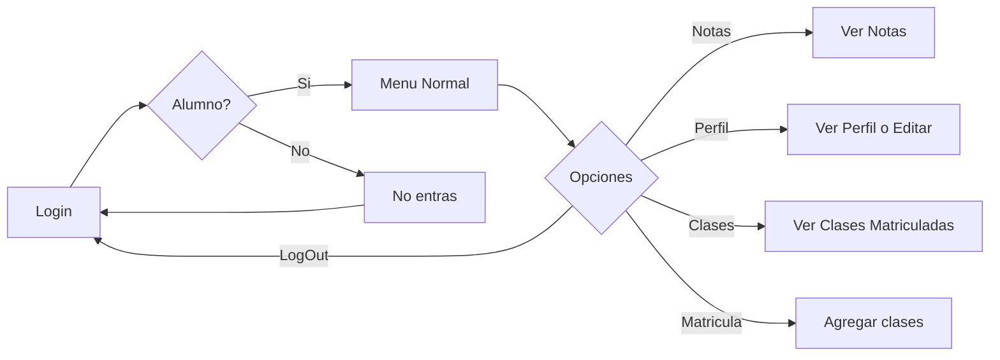

# GestorAcademico
GESTOR ACADÉMICO, NEGOCIOS WEB 2002 | EQUIPO 5

Usuario: admin
Contraseña: 123abcd!

## Requisitos
Dentro del entorno activo hacer la instalación siguiente:
- ```(entorno1) C:\entornos\entorno1>pip install django-phone-field```
- ```(entorno1) C:\entornos\entorno1>pip install Pillow```
##Diagramas
Flujo de los alumnos:
